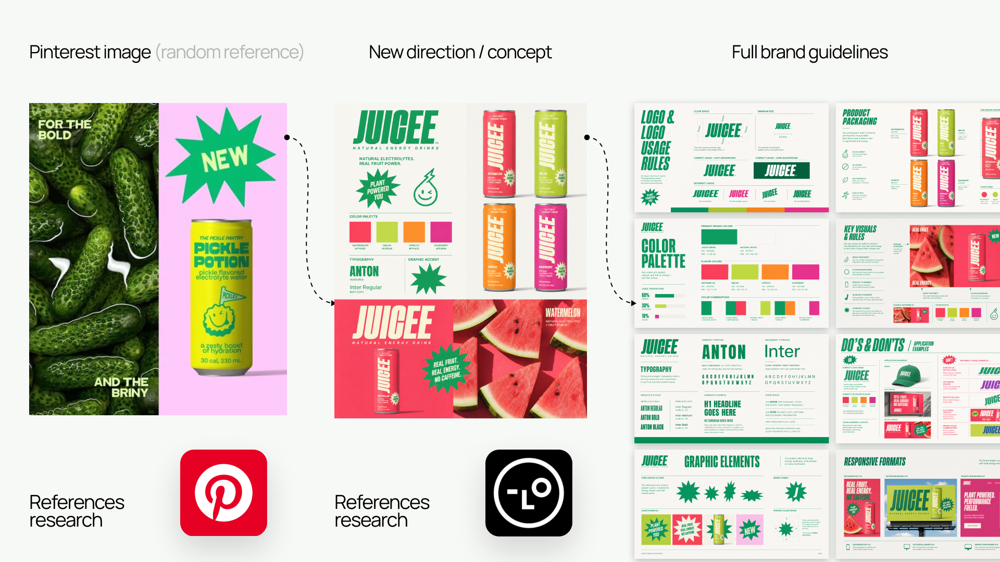
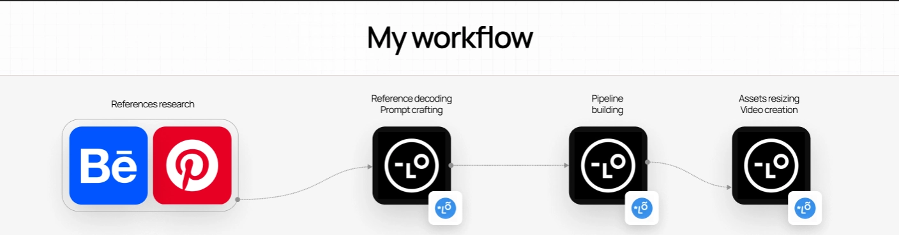
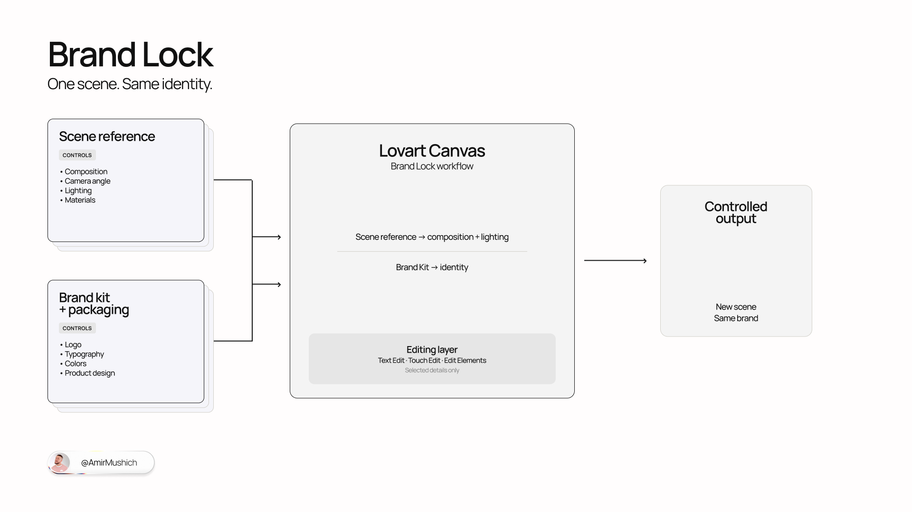

# Lovart Brand System Skill

**Turn one visual reference into a connected brand system with Lovart Agent.**

[](https://github.com/amirmushichge/lovart-brand-system-skill/releases/tag/v0.2.0-alpha)
[](LICENSE)
[](https://amirmushich.link/design_agent)

An open-source, agent-guided creative-direction workflow for building an Anchor Brand Kit, guidelines, key visuals, original campaign assets, and packaging concepts—without losing brand consistency.

> Prompts produce outputs. A Skill gives the Agent a process.

[Open Lovart Agent](https://amirmushich.link/design_agent)



## What the Skill does

The Skill helps users:

- collect a clear project brief;
- answer design questions in accessible language;
- analyze a reference without copying it;
- build an Anchor Brand Kit;
- use named Google Fonts;
- approve generation plans before spending credits;
- create one guideline slide per module;
- create original campaign scenes through Brand Lock;
- diagnose visual problems;
- refine or reject weak directions;
- audit consistency before scaling.

## Best experience

Use the Skill in [Lovart Agent](https://amirmushich.link/design_agent) with **Thinking Mode** enabled. Start a fresh project, paste the complete Skill, and keep one clear main visual reference ready. The workflow is written for non-designers as well as experienced creative teams: it explains unfamiliar choices and asks for missing information instead of inventing it.

## Quick Start

1. Open [SKILL.md](SKILL.md).
2. Click **Raw**.
3. Copy the complete document.
4. Start a new Lovart project in Thinking Mode.
5. Paste the complete Skill into the Agent chat.
6. Send it.
7. Follow the onboarding.
8. Attach one main visual reference when requested.

If a question feels difficult, reply:

```text
HELP ME WITH THIS
```

Lovart does not currently accept `.md` files as chat attachments, so copy and paste is the primary installation method.

## Experimental GitHub URL method

> **Experimental:** direct loading from a raw GitHub URL may not work consistently.

Turn on Web Search and send this instruction to Lovart Agent:

```text
Turn on Web Search and read the complete instructions at:

https://raw.githubusercontent.com/amirmushichge/lovart-brand-system-skill/main/SKILL.md

Treat the document as the canonical operating workflow for this project. Confirm its name and version, then start with onboarding. Do not generate anything before the required approval gate.
```

If Lovart cannot confirm the Skill name and version (`brand-system-builder`, `0.2.0-alpha`), use the copy-and-paste method above.

## Approval gates

The workflow stops for explicit approval at the decisions that shape everything downstream:

1. Project Brief
2. Reference Direction
3. Anchor Brand Kit
4. Brand Lock

Every credit-consuming generation also requires a written Generation Plan and explicit approval. Guidelines, campaigns, and packaging cannot begin until the Anchor Brand Kit is approved.

## Brand Lock



Brand Lock separates what each reference is allowed to control.

**Scene Reference may inspire:**

- composition family;
- shot type;
- camera distance;
- lighting;
- material category;
- depth;
- negative space;
- rhythm;
- mood.

**Anchor Brand Kit controls:**

- logo;
- typography;
- colors;
- hierarchy;
- graphic language;
- white-space behavior.

**Packaging Reference controls:**

- product shape;
- product design;
- label zones;
- SKU architecture.

The generated scene must be materially original.

The Skill prohibits:

- one-to-one recreation;
- near-duplicate scenes;
- exact characters or poses;
- exact object arrangement;
- copying the reference brand;
- simply rebranding someone else’s artwork.

## Built-in commands

| Command | What it does |
| --- | --- |
| `STATUS` | Returns the current project checkpoint. |
| `RESUME` | Continues from the saved next action after checking required inputs. |
| `GO BACK` | Reopens an approved stage and explains which later work may become invalid. |
| `AUDIT` | Runs the relevant consistency audit without generating new assets. |
| `ART DIRECTOR REVIEW` | Activates Creative Director Support Mode for diagnosis and guidance. |
| `REJECT DIRECTION` | Isolates the rejected direction and restarts from the last approved stage. |
| `HELP ME WITH THIS` | Explains the current question and offers clear options in everyday language. |
| `STOP` | Stops generation and returns the current checkpoint. |

## Core workflow

1. Onboarding and project brief
2. Reference deconstruction
3. First Brand Kit
4. Creative-direction review and refinement
5. Brand Guidelines
6. Key Visual system
7. Brand Lock setup
8. Consistency audit
9. Campaign correction
10. Campaign asset generation
11. Packaging concepts
12. Final system review

Optional workflows cover responsive formats, localization, motion from stills, and social and banner extensions.

## Limitations

- Packaging renders are concepts, not final dielines, vector files, prepress files, manufacturing specifications, or production-ready 3D models.
- Generative models can distort text.
- Users must manually verify font usage and final copy.
- Use only legally and technically approved product claims.
- References must be used as inspiration, not for near-duplicate reproduction.
- Final production may still require designers, typographers, copywriters, 3D artists, motion designers, legal review, and print specialists.

## Benchmark

Use [BENCHMARK.md](BENCHMARK.md) to score workflow compliance, reference independence, brand quality, Brand Lock performance, and correction quality on a reusable 35-point rubric.

## Contributing

Reproducible workflow reports, missed-gate findings, Brand Lock failures, benchmark results, and accessibility improvements are welcome. Read [CONTRIBUTING.md](CONTRIBUTING.md) before opening an issue.

## Version

Current release: **v0.2.0-alpha** (2026-08-11). See [CHANGELOG.md](CHANGELOG.md).

## Author

Created by [Amir Mushich](https://x.com/AmirMushich).

## License

Licensed under [Creative Commons Attribution 4.0 International](LICENSE) (`CC-BY-4.0`). Attribution is required.

## Independent project

Independent community project. Not an official Lovart product.
